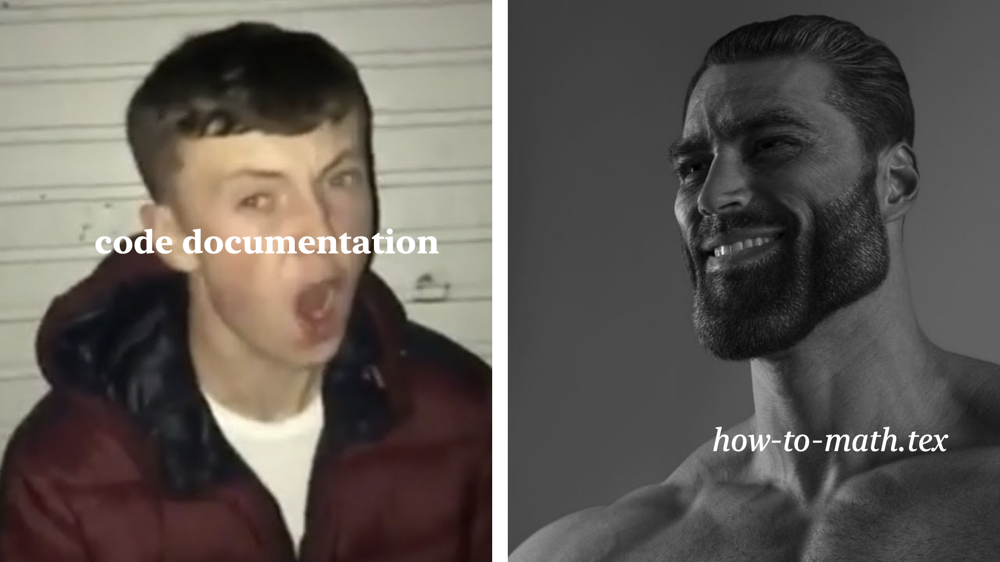

<picture>
  <source media="(prefers-color-scheme: light)" srcset="./graphic/sigma-light.png">
  <source media="(prefers-color-scheme: dark)" srcset="./graphic/sigma-dark.png">
  
</picture>

<br/><br/>

<picture>
  <source media="(prefers-color-scheme: light)" srcset="./graphic/neptunal-light.png" width=36% >
  <source media="(prefers-color-scheme: dark)" srcset="./graphic/neptunal-dark.png" width=36%>
  
</picture>

<br/><br/>

<picture>
  <source media="(prefers-color-scheme: light)" srcset="./graphic/solvation-light.png">
  <source media="(prefers-color-scheme: dark)" srcset="./graphic/solvation-dark.png">
  
</picture>

<br/><br/>

I will make a fully capable graphing calculator in Rust and you can't stop me.

As always, I'm not using libraries or any of that. Everything here is homemade :)

# **how to use**

don't even try to run it unless you want to contribute (or fix my terrible formatting), this is niether stable nor useable, nor useful if you did figure it out. I'll change this message if this project becomes any of those three.

math is explained in [./doc/how-to-math.pdf](./doc/how-to-math.pdf)



**basic syntax:**

Enter most stuff like you would with any normal calculator, except pay attention to spacing. 
Parenthesis dont need spacing, but the operators do. Also, because I'm cool, dot `·` and cross `×` work for multiplication.

```
3 + 4
[Σ] 7
(3 + 4) × 2
[Σ] 14
```

**number parsing:**

Numbers can be interpreted in a variety of ways, but Solvation only stores them as one of four types: the `Comp` for complex numbers (containing two `f64`s), the `Rat` for ratinal fractions (containing two `i32`s), `u16`, and `bool`. The parsing function for this homemade `Comp` type basically searches for "i" and a "+" or a "-". This means that within one complex number, the spaces surround "+" and "-" can be omitted, but they can also still be used and it's okay.

```
3.0
[Σ] 3.0
3+4i
[Σ] 3+4i
3.23-8.0i
[Σ] 3.23-8.0i
9i
[Σ] 0+9i
```

By default, all numbers will be parsed as `Comp`s, so that they can operate with other non-natural numbers. To indicate a `u16` value, use the leading-quote character as a prefix. The `++` operator is also available for the `u16` type, and it just increments a variable by one. To indicate a `Rat` value, use a dividing `/` in the middle of the token without spacing. Exponentiation does not work for `Rat`.

```
2/6
[Σ] 1/3
1/3 + 3/4
[Σ] 13/12
```

**variables:**

To declare a new variable, use the `=` operator between its name and value. This value can be an expression, and `complete()` will simplify it. Variable and function names are stored not as a `String`, but instead as a `[char; 5]`. This means that while you can still use >5-character names, the code will only store the first 5 characters, meaning it will not be able to distinguish between names `longname2` and `longname1`, and treat them as the same variable or function. The same operator can also be used for re-assignment.

```
x = 4
λ = 3 + 2
x * λ
[Σ] 20
λ = 6
x * λ
[Σ] 24
n = `1
n ++
n
[Σ] 2
```

**functions:**

To declare a function, use keyword `def`, followed by `name(inp1, inp2, ...)`, then the contents of the function. Solvation will analyze the input names and replace any instances of them with an input token. The commas here are important as they are used to separate inputs instead of spaces.

This example computes the magnitude of a diagonal line set by two inputs.

```
def mag(x, y) (x * x + y * y) ^ 0.5
[Σ] Done
mag(1,2)
[Σ] 2.2360198347089875
mag(1,1)
1.4142134378915125
```

**multitasking:**

You can complete multiple calculations in one line, although only one (the last one) will return. This is useful for variable assignment and reassignment, as these statements will not return values anyways, and rather execute something that will effect the calculation later on. Divide statements with commas.

```
x = `1, y = `2
x ++, y ++
x
[Σ] 2
y
[Σ] 2 
```

**loops and conditionals:**

To iterate a calculation, enclose the loop in [brackets]. These loops iterate without end, unless a break statement is added using `∇`. Conditionals are notated similarly to functions, but with a `:` as the same. The first argument is the condition to check, and the second is the action to do if it is `true`. Loops can only end when there is a `∇` inside, so your loop will probably contain `∇` within a conditional. As of right now, the break key `∇` follows through the current iteration of the loop, but doesn't start a new one. This may be fixed later.

```
x = `0
:(x == `3, 2)
:(x == `0, 2)
[Σ] 2
[ :(x == `50, ∇), x ++ ]
x
[Σ] 51
```

**built-in functions:**

Currently, the only stable built-in functions outside of trigonometry are `exp(x)` and `ln(x)`. These allow the exponentiatin operator `^` to function, and are essential in buliding many other functions. So far, trig, hyperbolic trig, and inverse trig are implemented. I'll get to inverse hyperbolic trig later.

```
sin(π / 4)
[Σ] 0.7071266960970306-0.00001634874552874921i
asin(sin(π / 4))
[Σ] 0.7860064746073497-0.000717974405438253i
π / 4
[Σ] 0.785398163375
```

`exp(x)` and `ln(x)` are only approximate, so error is always present.